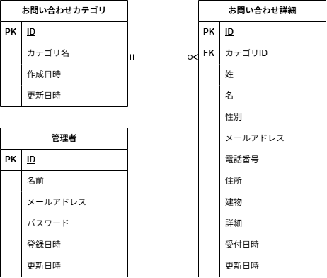

# アプリケーション名
お問い合わせフォーム

## 環境構築
Dockerビルド
1.git clone git@github.com:yoshi-bell/onoe-kadai01.git
2.docker-compose up -d --build

＊MySQLは、OSによって起動しない場合があるのでそれぞれのPCに合わせてdocker-compose.ymlファイルを編集してください。

Laravel環境構築
1.docker-compose exec php bash
2.composer install
3..env.exampleファイルから.envを作成し、環境変数を変更
4.php artisan key:generate
5.php artisan migrate
6.php artisan db:seed
＊シーディングにより、「お問い合わせの種類」5種類のデータ、お問い合わせ内容のダミーデータ35件がデータベースに入力されます。

## アプリケーションの機能
このアプリケーションは、Webサイトのユーザーからのお問い合わせを効率的に管理するためのシステムです。
主な機能は以下の通りです。

-お問い合わせフォームからの問い合わせ送信機能
-管理画面での問い合わせ一覧表示
-名前、メールアドレス、性別、お問い合わせ種別、日付による検索・絞り込み機能
-問い合わせ詳細の確認と削除機能

## 使用技術
・PHP 8.1.33
・Laravel 8.75
・MySQL 8.0.26

## ER図

## URL
・開発環境：http://localhost/
・お問い合わせフォーム入力ページ：/
・お問い合わせフォーム確認ページ：/confirm
・サンクスページ：/thanks
・管理画面：/admin
・ユーザ登録ページ：/register
・ログインページ：/login
・phpMyAdmin：http://localhost:8080/